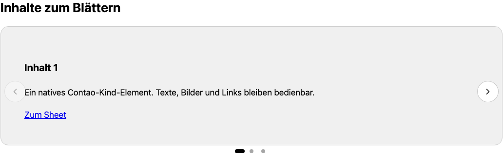
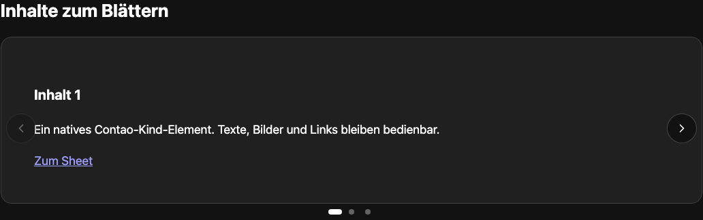

# Contao Carousel


Beliebige Contao-Inhalte als native Scroll-Snap-Slides, ohne Swiper, jQuery oder JavaScript-Laufzeitabhängigkeiten. Bereits das Server-Markup ist scrollbar; wenige kB JavaScript ergänzen Pfeile, Punkte, Mausziehen und pausierbares Autoplay.

Für Contao **^5.7 || ^6.0**. PHP 8.3+ für 5.7, PHP 8.4+ für 6.0. MIT. Release vorbereitet, noch nicht veröffentlicht.

## Installation

Im Contao Manager nach `nordwerk/contao-carousel-bundle` suchen (nach Veröffentlichung). Alternativ:

```sh
composer require nordwerk/contao-carousel-bundle
vendor/bin/contao-console contao:migrate
```

## Verwendung

In einem Artikel „Carousel“ anlegen, einen Namen für Hilfstechnologien und die Optionen setzen. Über das Kind-Element-Symbol beliebige Inhalte einfügen; ein direktes Kind ist ein Slide. Eine Elementgruppe bündelt mehrere Inhalte zu einem Slide. Die Anzahl pro Ansicht bezieht sich auf die **Containerbreite**, mit Breakpoints 600 und 960 px; Dezimalwerte sind möglich.

Pfeile und Punkte sind optional. Autoplay `0` deaktiviert die Wiedergabe; aktive Intervalle liegen bei 1000–60000 ms. Der Pausenknopf gehört immer dazu. Die Originalkomponente stoppt bei Tastaturfokus und startet bei reduzierter Bewegung pausiert. Touch-Wischen und Scroll-Snap funktionieren ohne JS. Mausziehen ist eine optionale Verbesserung.

System → Einstellungen → Nordwerk Carousel enthält den separaten Schalter für den Kern-Swiper. Er ist standardmäßig aus. Er unterstützt native Swiper-Elemente mit Standard-Twig-Template; eigene Templates und alte Start-/Stop-Slider werden respektiert. Endlosschleifen werden zu Rücksprung, eine frei gewählte Animationsgeschwindigkeit ist mit nativem Scrollen nicht verfügbar. Manuell im Layout aktivierte Swiper-Skripte bitte selbst entfernen.

Templates: `content_element/nw_carousel.html.twig` und `component/_nw_carousel.html.twig`. CSS-Theme über die Custom Properties der [OSS-Komponente](https://www.nordwerk.studio/oss/scroll-carousel). Die Assets sind `@nordwerk/scroll-carousel@0.1.5`, MIT, unverändert vendort.

## Twig-Integration

Alle Bausteine funktionieren als Include/Embed ohne Inhaltselement. CSS und Module laden automatisch genau einmal; bei eigenem Markup gibt es `nw_carousel_assets()`. Variablen, Blöcke, Browsergrenzen und das Beispiel „Produktbilder mit Lightbox“: [Integrationsdokumentation](docs/integration.md).

## Ausgelieferte Größe

Einzeln gzip-komprimierte Dateien (Bytes; Original-ESM, ohne nachträgliche Minifizierung), inklusive statischer Importe und Contao-Anbindung. Dynamische Plugins zählen nur bei Nutzung. Bilder, HTML und HTTP-Header sind nicht enthalten. Reproduzierbar im Monorepo mit `python3 scripts/asset-sizes.py`.

| Teil                            | gzip, Bytes |
| ------------------------------- | ----------: |
| JavaScript mit Contao-Anbindung |        7899 |
| CSS                             |        2611 |
| Mausziehen zusätzlich           |        1132 |
| Autoplay zusätzlich             |         994 |

## Screenshots aus Playwright





## Quellen und Grenzen

Original-Assets von [@nordwerk/scroll-carousel 0.1.5](https://www.nordwerk.studio/oss/scroll-carousel), MIT. Kein echter geklonter Endlosloop, kein vertikaler Slider; nativ mit Rücksprung. Custom Properties und Browsergrenzen sind im OSS-Projekt dokumentiert. Eigene Templates und manuell im Seitenlayout eingebundene Swiper-Skripte erfordern eine bewusste Betreiberanpassung.

Die unveränderten npm-Dateien werden im Monorepo gepinnt und mit Prüfsummen abgeglichen. Kein Build bei Contao-Nutzern. Geprüft mit PHPUnit, PHPStan, ECS, Twig-CS, Contao-Lints sowie Playwright und Axe auf Contao 5.7/6.0.
