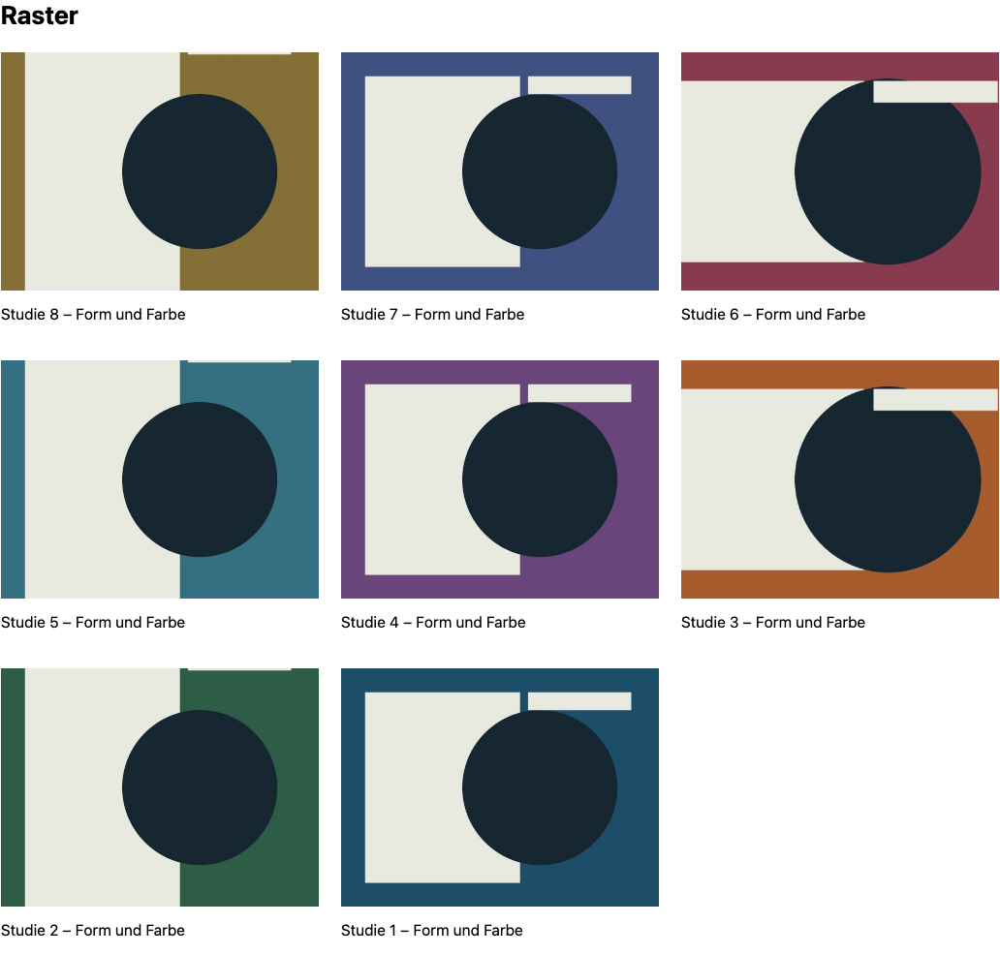
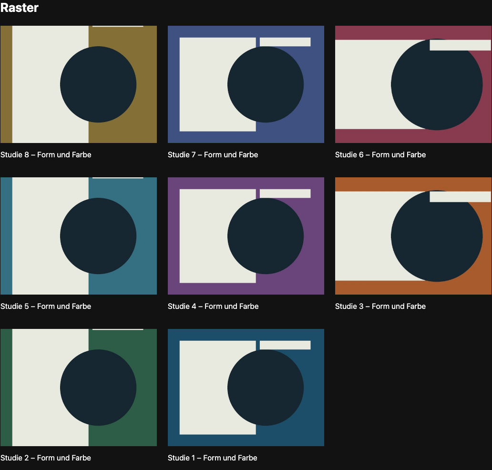

# Contao Gallery


Contaos responsive Bilder und Dateimetadaten als Raster, wechselnde Formate oder native Bilderleiste, ohne Swiper, jQuery oder JavaScript-Laufzeitabhängigkeiten. Die Sheet-Lightbox ergänzt Tastatur und Wischen; ohne JavaScript bleiben Bilder und Links nutzbar.

Für Contao **^5.7 || ^6.0**. PHP 8.3+ für 5.7, PHP 8.4+ für 6.0. MIT. Release vorbereitet, noch nicht veröffentlicht.

## Installation

Im Contao Manager nach `nordwerk/contao-gallery-bundle` suchen (nach Veröffentlichung). Alternativ:

```sh
composer require nordwerk/contao-gallery-bundle
vendor/bin/contao-console contao:migrate
```

## Verwendung

Im Artikel das Inhaltselement **Nordwerk UI → Galerie** anlegen, Dateien oder einen Ordner auswählen, sortieren und eine Contao-Bildgröße wählen. Raster, wechselnde Formate und Leiste stehen zur Auswahl; „Großansicht/Neues Fenster“ aktiviert die native Sheet-Lightbox. Alt-Texte und Bildunterschriften stammen aus der Dateiverwaltung. Die Lightbox übernimmt die Großansichtsgröße des Seitenlayouts.

Die Leiste nutzt `@nordwerk/scroll-carousel` 0.1.5, die Lightbox `@nordwerk/scroll-sheet` 0.5.0. Deren veröffentlichte Originaldateien liefern Layout und Verhalten; das Galerie-Bundle verbindet die APIs. Es installiert beide Contao-Bundles automatisch. Ohne JavaScript bleiben Raster und Leiste sichtbar und große Bilder über normale Links erreichbar. Mit JavaScript: direkt zum gewählten Bild, Pfeile, Tastatur, Touch-Wischen, Escape und Fokus-Rückgabe.

Wechselnde Formate verwenden ein CSS-Raster mit stabiler Bildreihenfolge. Externe Metadatenlinks bleiben normale Links. Der globale Ersatz vorhandener Kern-Lightboxen ist zurückgestellt, siehe Grenzen unten. Twig-Bausteine und ein Beispiel „Produktbilder mit Lightbox“ stehen in [Integrationsdokumentation](docs/integration.md).

## Twig-Integration

Alle Bausteine funktionieren als Include/Embed ohne Inhaltselement. CSS und Module laden automatisch genau einmal; bei eigenem Markup gibt es `nw_gallery_assets()`. Variablen, Blöcke, Browsergrenzen und das Beispiel „Produktbilder mit Lightbox“: [Integrationsdokumentation](docs/integration.md).

## Ausgelieferte Größe

Einzeln gzip-komprimierte Dateien (Bytes; Original-ESM, ohne nachträgliche Minifizierung), inklusive statischer Importe und Contao-Anbindung. Dynamische Plugins zählen nur bei Nutzung. Bilder, HTML und HTTP-Header sind nicht enthalten. Reproduzierbar im Monorepo mit `python3 scripts/asset-sizes.py`.

| Teil                                                        | gzip, Bytes |
| ----------------------------------------------------------- | ----------: |
| Eigene JavaScript-Anbindung                                 |         947 |
| Eigenes Layout-CSS                                          |         670 |
| Leiste/Lightbox: JS inklusive beider Bundles und Mausziehen |       14165 |
| Leiste/Lightbox: CSS inklusive beider Bundles               |        7998 |

## Screenshots aus Playwright





## Quellen und Grenzen

Original-Assets von [@nordwerk/scroll-carousel 0.1.5](https://www.nordwerk.studio/oss/scroll-carousel) und [@nordwerk/scroll-sheet 0.5.0](https://www.nordwerk.studio/oss/scroll-sheet), MIT. CSS-Raster bewahrt die Lese-/Tab-Reihenfolge, kein Spalten-Masonry. Der globale Kern-Lightbox-Ersatz ist zurückgestellt, weil eigene Templates, Pagination, externe Metadatenlinks und manuelle Layout-Skripte getrennte Kompatibilitätsprüfungen brauchen. Bestehende Kern-Bilder behalten ihre Ausgabe.

Die unveränderten npm-Dateien werden im Monorepo gepinnt und mit Prüfsummen abgeglichen. Kein Build bei Contao-Nutzern. Geprüft mit PHPUnit, PHPStan, ECS, Twig-CS, Contao-Lints sowie Playwright und Axe auf Contao 5.7/6.0.
