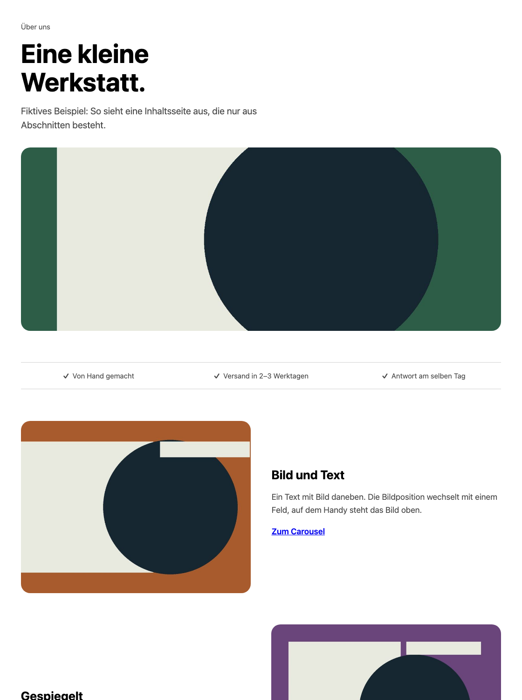

# Contao Abschnitte


Zwölf Inhaltselemente für Inhaltsseiten wie „Über uns“, „Kontakt“ oder eine Leistungsseite: Hero, Seitenkopf, Versprechen, Bild und Text, Zahlen, Merkmale, Ablauf, Team mit Personen, Logos, Kontakt und Abschluss-Kachel. Jedes Element hat wenige, klar benannte Felder; CSS-Klassen müssen Redakteure nicht eintippen. Ohne JavaScript, das Team-Karussell nutzt das native [Carousel-Bundle](https://github.com/studio-nordwerk/contao-carousel).

Für Contao **^5.7 || ^6.0**. PHP 8.3+ für 5.7, PHP 8.4+ für 6.0. MIT. Version 0.1.0.



## Installation

Im Contao Manager nach `nordwerk/contao-sections-bundle` suchen oder das Manager-ZIP aus den [GitHub-Releases](https://github.com/studio-nordwerk/contao-sections/releases) hochladen. Alternativ:

```sh
composer require nordwerk/contao-sections-bundle
vendor/bin/contao-console contao:migrate
```

## Elemente

Im Artikel unter **Nordwerk Abschnitte**:

| Element           | Felder                                                                                                                                                                 |
| ----------------- | ---------------------------------------------------------------------------------------------------------------------------------------------------------------------- |
| Hero              | Dachzeile, Überschrift, Text, Bild, bis zu zwei Buttons                                                                                                                |
| Seitenkopf        | Dachzeile, Überschrift, Einleitung, Bild im Breitformat (optional)                                                                                                     |
| Versprechen-Zeile | Bis zu vier kurze Zeilen mit Häkchen                                                                                                                                   |
| Bild und Text     | Überschrift, Text, Bild, Bild links oder rechts, ein Link                                                                                                              |
| Zahlen            | Zwei bis vier Einträge aus Zahl (Einheit darf dranstehen, z. B. „6 Wo.“) und Beschriftung, Hinweis für Quelle oder Stand                                               |
| Merkmale          | Überschrift, Einleitung, Einträge aus Symbol (16 zur Auswahl), Titel und Text                                                                                          |
| Ablauf            | Überschrift, Einleitung, zwei bis sechs Schritte; die Nummern setzt das Element                                                                                        |
| Team              | Überschrift, Einleitung, Raster oder Karussell, Hinweis. Die Personen sind Kind-Elemente **Person**: Foto, Name, Rolle, ein Satz                                       |
| Logos             | Überschrift, Logos aus der Dateiverwaltung in gewählter Reihenfolge. Ein Link in den Datei-Metadaten macht ein Logo klickbar                                           |
| Kontakt           | Name, Adresse, Telefon, E-Mail (kodiert ausgegeben), Öffnungszeiten, Hinweis. „Route planen“ öffnet OpenStreetMap mit der Adresse; ein eigener Routen-Link ist möglich |
| Abschluss-Kachel  | Überschrift, Text, Button                                                                                                                                              |

Hero und Seitenkopf geben ihre Überschrift immer als `h1` aus; pro Seite gehört nur eines der beiden an den Anfang. Bilder werden passend zugeschnitten, Alt-Text und Bildunterschrift kommen aus der Dateiverwaltung. Das erste Bild in Hero und Seitenkopf lädt sofort, alle anderen verzögert. Feldnamen gibt es auf Deutsch und Englisch.

## Gestaltung

Das Stylesheet lädt jedes Element selbst, genau einmal je Seite. Im Seitenlayout ist nichts einzubinden. Die Elemente übernehmen Schrift und Textfarbe der Website und gestalten nur über die gemeinsamen `--nw-*`-Variablen der Nordwerk-Bundles. Ohne Werte gelten neutrale, aus der Textfarbe abgeleitete Rückfallwerte; dunkle Seiten funktionieren damit ohne eigene Regeln.

| Variable                                  | Wirkung                               | Rückfallwert                 |
| ----------------------------------------- | ------------------------------------- | ---------------------------- |
| `--nw-accent`, `--nw-accent-contrast`     | Hauptbutton                           | `CanvasText`, `Canvas`       |
| `--nw-border`                             | Linien                                | Textfarbe mit 24 % Deckkraft |
| `--nw-surface`                            | Kontaktkarte                          | durchsichtig                 |
| `--nw-radius-card`, `--nw-radius-control` | Radien                                | `1.125rem`, `0.75rem`        |
| `--nw-muted`                              | Nebentext                             | Textfarbe mit 72 % Deckkraft |
| `--nw-tile`                               | Flächen von Zahlen, Symbolen, Bildern | Textfarbe mit 7 % Deckkraft  |
| `--nw-callout`                            | Abschluss-Kachel                      | wie `--nw-tile`              |
| `--nw-heading-font`                       | große Zahlen und Schrittnummern       | geerbt                       |
| `--nw-success`                            | Häkchen der Versprechen               | Textfarbe                    |
| `--nw-page`                               | Hintergrund der Schrittnummern        | `Canvas`                     |

Das Stylesheet lädt vor den Stylesheets des Seitenlayouts; Theme-Regeln mit gleicher Spezifität gewinnen. Für die Überschriften in den Abschnitten trägt das Bundle eine Klasse mehr, damit allgemeine Theme-Regeln wie `.theme h2` die Abschnitte nicht sprengen. Varianten der Vorlagen `content_element/nw_*` legen Sie im Template Studio an.

Die [Nordwerk-Themes](https://www.nordwerk.studio/contao) setzen alle Variablen passend zu Palette und Schrift.

## Twig-Integration

`nw_sections_assets()` lädt das Stylesheet für eigenes Markup, `nw_section_icon(name)` gibt eines der Linien-Symbole aus. Beispiel und die Bausteine der anderen Bundles: [Integrationsdokumentation](docs/integration.md).
