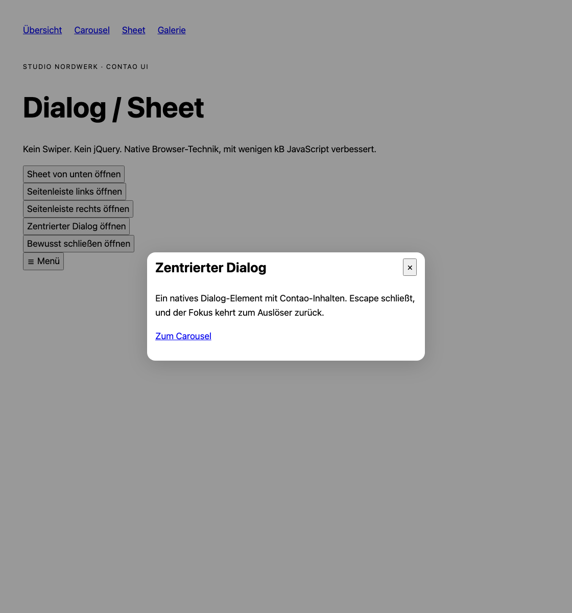
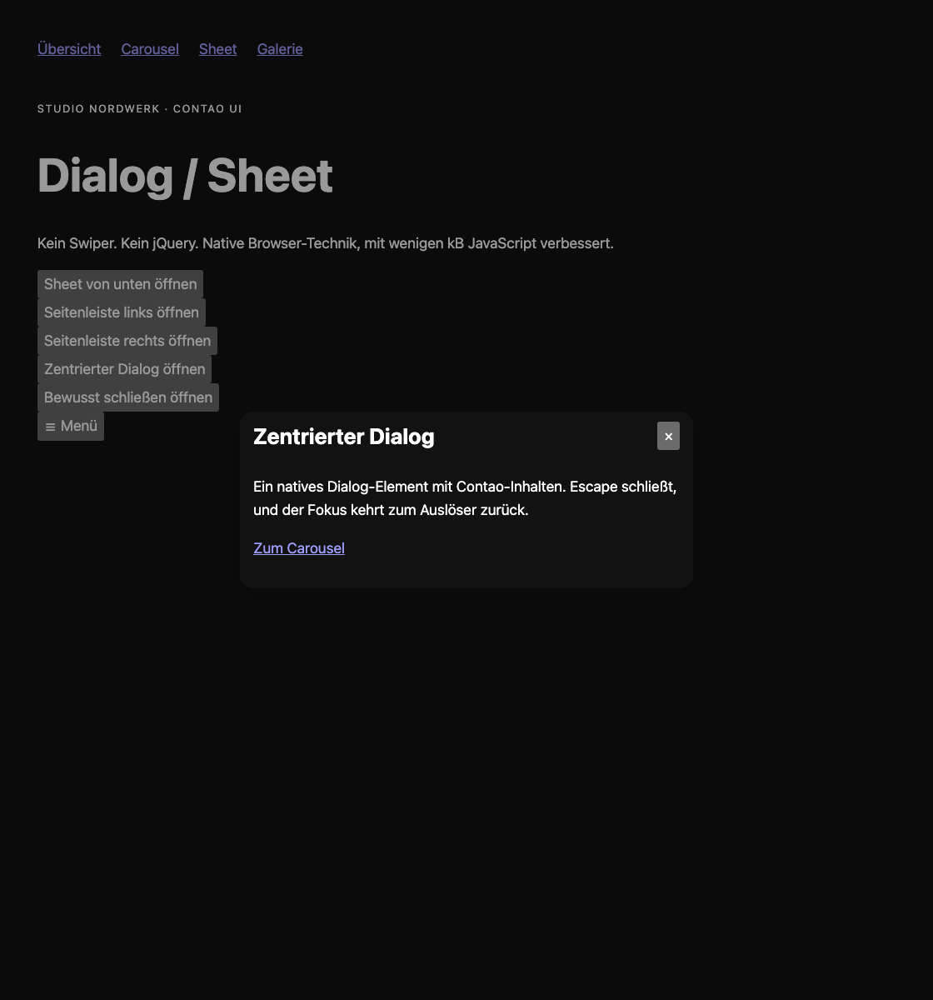

# Contao Sheet


Dialoge, Bottom-Sheets und Offcanvas-Navigation mit nativen Contao-Inhalten und `<dialog>`, ohne jQuery oder JavaScript-Laufzeitabhängigkeiten. Native Buttons funktionieren ohne JavaScript; die kleine Original-Komponente ergänzt Einrastpunkte, Hintergrund-Schließen, Fokus-Rückgabe und History.

Für Contao **^5.7 || ^6.0**. PHP 8.3+ für 5.7, PHP 8.4+ für 6.0. MIT. Release vorbereitet, noch nicht veröffentlicht.

## Installation

Im Contao Manager nach `nordwerk/contao-sheet-bundle` suchen (nach Veröffentlichung). Alternativ:

```sh
composer require nordwerk/contao-sheet-bundle
vendor/bin/contao-console contao:migrate
```

## Verwendung

„Dialog / Sheet“ in einem Artikel anlegen, Dialogtitel, Darstellung und Optionen wählen. Über das Kind-Element-Symbol beliebige Contao-Inhalte einfügen. „Dialog-Button“ auf derselben Seite anlegen und das Ziel-Sheet auswählen. Die Aktion „Öffnen“ erzeugt einen nativen `commandfor`-Button, „Schließen“ eignet sich als Abschluss-Button innerhalb eines Sheets.

Einrastpunkte wie `50,75` sind Prozentwerte der Viewport-Höhe (5–95). Sie gelten für Bottom-Sheets. Ohne „Schließen erlauben“ bleiben Escape, Hintergrund und Wegwischen ohne Wirkung; ein ausdrücklich eingefügter Abschluss-Button darf weiterhin schließen. Deshalb immer einen erreichbaren Abschluss anbieten.

Für Offcanvas zuerst ein Kern-Navigationsmodul anlegen. Danach „Offcanvas-Navigation“ erstellen, das Navigationsmodul und die Darstellung wählen und das Modul im Layout oder als Inhaltselement einbinden. Der Burger öffnet die native Seitenleiste; die Zurück-Taste schließt sie über das Original-History-Plugin.

Ohne JavaScript funktionieren Öffnen, Schließtaste und Escape mit Invoker Commands (Chromium 135+, Firefox 144+, Safari 26.2+). Ältere Browser erhalten den Fallback mit JS. Hintergrund-Tipp, Fokuskorrekturen, Einrastpunkt beim Öffnen und History sind progressive Verbesserungen.

Templates: `content_element/nw_sheet.html.twig`, `content_element/nw_sheet_button.html.twig`, `frontend_module/nw_offcanvas_navigation.html.twig`, `component/_nw_sheet.html.twig`. Theme über die Custom Properties der [OSS-Komponente](https://www.nordwerk.studio/oss/scroll-sheet). Unveränderte Assets: `@nordwerk/scroll-sheet@0.5.0`, MIT.

## Twig-Integration

Alle Bausteine funktionieren als Include/Embed ohne Inhaltselement. CSS und Module laden automatisch genau einmal; bei eigenem Markup gibt es `nw_sheet_assets()`. Variablen, Blöcke, Browsergrenzen und das Beispiel „Produktbilder mit Lightbox“: [Integrationsdokumentation](docs/integration.md).

## Ausgelieferte Größe

Einzeln gzip-komprimierte Dateien (Bytes; Original-ESM, ohne nachträgliche Minifizierung), inklusive statischer Importe und Contao-Anbindung. Dynamische Plugins zählen nur bei Nutzung. Bilder, HTML und HTTP-Header sind nicht enthalten. Reproduzierbar im Monorepo mit `python3 scripts/asset-sizes.py`.

| Teil                              | gzip, Bytes |
| --------------------------------- | ----------: |
| JavaScript mit Contao-Anbindung   |        4528 |
| CSS mit Farb-Tokens               |        4717 |
| Mausziehen zusätzlich             |        1482 |
| History zusätzlich                |        1096 |
| Nicht wegklickbar: CSS zusätzlich |         592 |

## Screenshots aus Playwright





## Quellen und Grenzen

Original-Assets von [@nordwerk/scroll-sheet 0.5.0](https://www.nordwerk.studio/oss/scroll-sheet), MIT. Ohne JS benötigen die Buttons Invoker Commands; ältere Browser erhalten den JS-Fallback. Ein nicht wegklickbarer Dialog muss einen expliziten Abschluss anbieten.

Die unveränderten npm-Dateien werden im Monorepo gepinnt und mit Prüfsummen abgeglichen. Kein Build bei Contao-Nutzern. Geprüft mit PHPUnit, PHPStan, ECS, Twig-CS, Contao-Lints sowie Playwright und Axe auf Contao 5.7/6.0.
