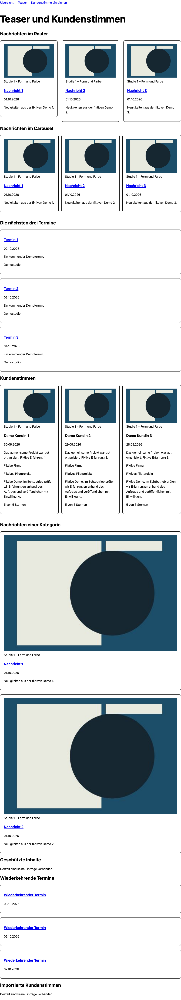

# Contao Teasers Bundle

MIT · Contao **^5.7 || ^6.0**, PHP ^8.3 · Twig only.

Ein Inhaltselement und Frontend-Modul **Teaser** zeigt Nachrichten, kommende Termine
oder Kundenstimmen als Raster, Liste oder Carousel. Andere Pakete können Quellen
anmelden. Carousel nutzt `nordwerk/contao-carousel-bundle` mit Scroll Snap; kein
Swiper oder jQuery. Ohne JavaScript bleiben Karten, Texte und Links erreichbar.



## Installation

```sh
composer require nordwerk/contao-teasers-bundle
php bin/console contao:migrate --no-interaction
```

Noch unveröffentlicht: Composer benötigt bis zur ersten Veröffentlichung lokale
Path-Repositories für `packages/teasers` und `packages/carousel` mit Version
`0.1.x-dev` (siehe Demo-Manifest). Es wurden keine Pakete veröffentlicht.

News-, Calendar- und Carousel-Bundle werden als Abhängigkeiten installiert.
Kundenstimmen kommen separat aus `nordwerk/contao-testimonials-bundle`.

## Im Backend

1. Inhaltselement oder Frontend-Modul **Teaser** anlegen.
2. Quelle wählen und speichern, dann Archive/Kalender auswählen. Nach Quellenwechsel
   Archive erneut auswählen; Archive werden niemals implizit vollständig geöffnet.
3. Anzahl (1–100), Sortierung, Ansicht, Spalten und zugängliche Bezeichnung einstellen.
4. Contao-Bildgröße wählen, bei Modulen über das Kernfeld `imgSize`.

News: nur veröffentlichte Einträge mit bereits erreichtem Datum und aktivem
Veröffentlichungszeitraum. Geschützte Archive werden anhand der aktuellen
Mitgliedsgruppen geprüft. Optionaler Kategorienfilter: Codefog-Relation
`tl_news_categories(news_id, category_id)`; mehrere Kategorien sind ODER-verknüpft.
Ist diese Relation nicht vorhanden, liefert eine gesetzte Kategorie keine Einträge.
Codefogs derzeitiges Manifest unterstützt Contao 5; für Contao 6 muss die jeweilige
Kategorie-Erweiterung selbst kompatibel sein. Die Demo nutzt eine fiktive Testrelation.

Events: Contao-Generator inklusive Wiederholungen, nächste Startzeitpunkte innerhalb
von zwei Jahren. Vergangene und bereits laufende Termine werden ausgelassen;
mehrtägige Termine werden einmal ausgegeben. Datumssortierung ist immer aufsteigend,
alternativ Titel A–Z. Anzahl begrenzt die tatsächlichen Vorkommen, nicht die Datensätze.

Kundenstimmen: nur freigegebene Einträge, optional Mindeststerne; Sterne absteigend
oder Datum/Titel. Preis/Sterne sind optionale Bestandteile des Vertrags. Quellen
sollen nicht unterstützte Filter dokumentieren. Kein Review-/AggregateRating-Markup.

Die Ausgabe setzt `private, no-store`: Freigaben und Mitgliedsrechte wirken sofort,
auch bei vorher leeren Listen. Das ist eine bewusste erste Implementierung ohne
zusätzliche öffentliche Listencaches. Bei eigenen Quellen keine personenbezogenen
Daten in `meta` ausgeben. Contao behandelt Inhaltselement-/Modulberechtigungen selbst;
Redakteursrechte für Archive und ausgeschlossene Felder im Backend passend vergeben.

## Twig für Themes

Contao Template Studio kann folgende Templates überschreiben:

- `content_element/nw_teaser.html.twig`
- `frontend_module/nw_teaser.html.twig`
- `component/_nw_teasers.html.twig` (Ansichten und Listen)
- `component/_nw_teaser_card.html.twig` (eine Karte)

Die Karte hat die Blöcke `card_image`, `card_title`, `card_date`, `card_text`,
`card_meta`, `card_stars`, `card_price`. `card` enthält das Vertragsobjekt,
`figure` eine Contao-Studio-Figure oder `null`. Das Listen-Template erhält `cards`
als Liste von `{card, figure}`, `teaser_id`, `teaser_label`, `teaser_layout` und
`teaser_columns`. HTML aus Quellen wird nicht ungeprüft ausgegeben: Text ist Klartext
und Twig escaped automatisch. Links erlauben nur HTTP(S), absolute lokale Pfade und
Fragmente. Bilder müssen aus dem öffentlichen Contao-Dateibestand kommen.

Beispiel für eine Anpassung in `templates/component/_nw_teaser_card.html.twig`:

```twig



    <p class="product-price">{{ card.price }}</p>

```

## Eigene Quellen

`TeaserSourceInterface` ist der Vertrag. Bei Symfony-Autoconfiguration wird er
mit `nordwerk.teaser_source` getaggt. Ohne Autoconfiguration:

```yaml
services:
  App\Teaser\NewProductsSource:
    autowire: true
    autoconfigure: false
    tags: [nordwerk.teaser_source]
```

Der Schlüssel ist eindeutig, 1–64 ASCII-Zeichen lang, beginnt mit einem Kleinbuchstaben
und besteht aus Kleinbuchstaben, Ziffern und Unterstrichen (`[a-z][a-z0-9_]{0,63}`).
Ungültige oder doppelte Schlüssel werden beim Aufbau der Registry abgewiesen.
`getLabel()` liefert einen Übersetzungsschlüssel aus `messages`;
`getArchives()` eine Zuordnung `{positive ID: Name}` für die Backend-Auswahl, gefiltert
nach den Rechten der aktuellen Redakteurin. News/Kalender verwenden dieselben
Archivberechtigungen wie die Contao-Kernmodule.
`fetch(TeaserQuery $query)` liefert `iterable<Card>`: berechtigte, veröffentlichte
Einträge in der gewünschten Reihenfolge, höchstens `limit`. Der Renderer begrenzt
zusätzlich. Keine globalen Benutzer- oder Requestzustände in der Quelle behalten.

Das folgende vollständige Dienstbeispiel nutzt ein **beispielhaftes Shop-Schema**,
keine Behauptung über das spätere Mini-Shop-Datenmodell:
`tl_shop_category(id, title)` und
`tl_shop_product(id, category_id, title, description, image_uuid, reader_url,
created_at, price_cents, published, available)`. Preise sind hier EUR inklusive
Steuer. Der Shop stellt die Voter `shop.category.edit` (Backend-Auswahl) und
`shop.category.view` (Frontend-Zugriff) bereit; Schema und Voter sind Voraussetzungen
im Fremdpaket. Query und Kartenmapping sind vollständig; Tabellennamen/Felder und
Preisformat an den tatsächlichen Shop anpassen.

```php
<?php

declare(strict_types=1);

namespace App\Teaser;

use Doctrine\DBAL\ArrayParameterType;
use Doctrine\DBAL\Connection;
use Nordwerk\TeasersBundle\Card\Card;
use Nordwerk\TeasersBundle\Query\TeaserQuery;
use Nordwerk\TeasersBundle\Source\TeaserSourceInterface;
use Symfony\Bundle\SecurityBundle\Security;

final class NewProductsSource implements TeaserSourceInterface
{
    public function __construct(
        private readonly Connection $connection,
        private readonly Security $security,
    ) {
    }

    public function getKey(): string
    {
        return 'new_products';
    }

    public function getLabel(): string
    {
        return 'shop.new_products';
    }

    public function getArchives(): array
    {
        $choices = [];
        foreach ($this->connection->fetchAllKeyValue('SELECT id, title FROM tl_shop_category ORDER BY title') as $id => $title) {
            if ($this->security->isGranted('shop.category.edit', (int) $id)) {
                $choices[(int) $id] = (string) $title;
            }
        }

        return $choices;
    }

    public function fetch(TeaserQuery $query): iterable
    {
        $categories = array_values(array_filter($query->archives, fn (int $id): bool => $this->security->isGranted('shop.category.view', $id)));
        if (!$categories) {
            return;
        }

        $order = match ($query->sort) {
            'date_asc' => 'created_at ASC',
            'title_asc' => 'title ASC',
            default => 'created_at DESC',
        };
        $rows = $this->connection->fetchAllAssociative(
            'SELECT * FROM tl_shop_product WHERE category_id IN (?) AND published=1 AND available=1 AND created_at<=? ORDER BY '.$order.', id DESC LIMIT '.$query->limit,
            [$categories, time()],
            [ArrayParameterType::INTEGER],
        );
        $plain = static fn (string $value): string => html_entity_decode(strip_tags($value), ENT_QUOTES | ENT_HTML5);

        foreach ($rows as $row) {
            yield new Card(
                title: $plain((string) $row['title']),
                text: $plain((string) $row['description']),
                image: $row['image_uuid'] ? (string) $row['image_uuid'] : null,
                link: (string) $row['reader_url'],
                date: (new \DateTimeImmutable())->setTimestamp((int) $row['created_at']),
                price: number_format((int) $row['price_cents'] / 100, 2, ',', '.').' €',
            );
        }
    }
}
```

Die YAML-Registrierung oben gehört in `config/services.yaml` der Anwendung, der
Dienst in `src/Teaser/NewProductsSource.php`; `translations/messages.de.yaml`
enthält `shop.new_products: Neue Produkte`. Dieses Beispiel verwendet die
Archiv-Auswahl für Kategorien; `categories` und `minStars` bleiben ungenutzt,
`stars_desc` fällt auf neueste Produkte zurück. **Hervorgehobene Produkte** können
als eigene Quelle mit `featured=1` filtern; **passende Produkte** benötigen einen
requestabhängigen Produktkontext und dieselben Sichtbarkeitsprüfungen.

`TeaserQuery`: `archives`, `categories`, `limit`, `sort` (`date_desc`, `date_asc`,
`title_asc`, `stars_desc`), `minStars`. `Card`: `title`, `text`, `image` (lokale UUID
oder Pfad), `link`, `date` (`DateTimeImmutable`), `meta` (String-Zuordnung), `price`
(Anzeige-String), `stars` (1–5 oder null).

Spätere Mini-Shop-Beispiele: **neue Produkte** fragt veröffentlichte Produkte nach
Erstellungsdatum ab; **passende Produkte** bezieht den aktuellen Produktkontext ein
und gibt nur sichtbare, kaufbare passende Produkte zurück. Beide Quellen werden
hier nur dokumentiert; das Bundle enthält keine Shop-Anbindung und kein Product-Markup.
