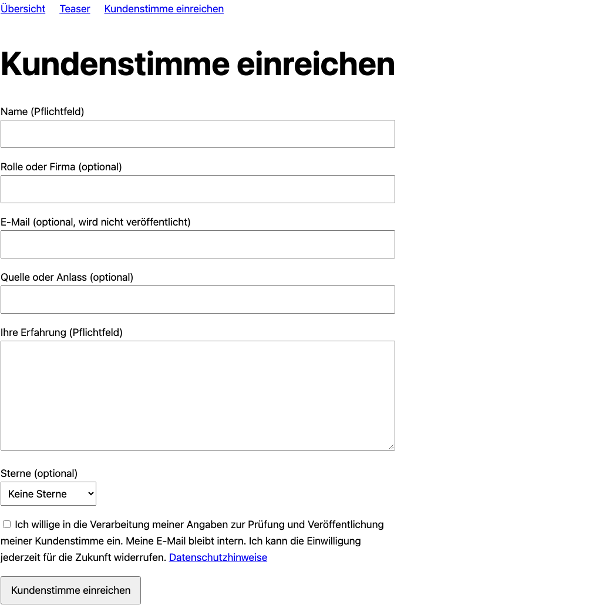

# Contao Testimonials Bundle

MIT · Contao **^5.7 || ^6.0**, PHP ^8.3 · Twig only.

Kleine Sammlung von Kundenstimmen mit Archiv, Name, Rolle/Firma, Erfahrung,
optionalen Sternen (1–5), Datum, Bild und Quelle/Anlass. Ein Einreichformular nimmt
Erfahrungen nach Einwilligung entgegen. Veröffentlichung erfolgt ausschließlich
nach Backend-Freigabe. Ausgabe über das Teaser-Bundle, auch als Carousel.



## Installation und Einrichtung

```sh
composer require nordwerk/contao-testimonials-bundle
php bin/console contao:migrate --no-interaction
```

Noch unveröffentlicht: Bis zur Veröffentlichung lokale Path-Repositories für
Testimonials, Teasers und Carousel mit `0.1.x-dev` verwenden; siehe Demo-Manifest.

1. Unter **Inhalte → Kundenstimmen** ein Archiv anlegen. Die öffentlichen Hinweise
   erklären, ob und wie die Erfahrungen geprüft werden; sie erscheinen bei den Karten.
2. Frontend-Modul **Kundenstimme einreichen** anlegen: Zielarchiv, Mail-Empfängerin,
   konkreter Einwilligungstext und veröffentlichte Datenschutzseite sind Pflicht.
3. Modul als Inhaltselement oder im Seitenlayout einbinden. Ohne diese Einstellungen
   nimmt das Formular keine Daten an. Absender und Mail-Transport in Contao einrichten.
4. Inhaltselement/Modul **Teaser** mit Quelle **Kundenstimmen** und Archiv erstellen.
5. Eingegangene Stimme prüfen, im internen **Prüfvermerk** Herkunft und Rechte
   dokumentieren, dann **Veröffentlicht** aktivieren. Ein Prüfvermerk ist Pflicht.

Die E-Mail-Adresse ist freiwillig und intern. Einwilligung wird mit Zeitpunkt,
gezeigtem Text und Datenschutzlink gespeichert. Keine IP-Speicherung. Checkbox ist
anfangs leer; serverseitige Prüfung, Contao-CSRF und ein Sitzungstoken gegen
wiederholtes Senden sind aktiv. Ein Honeypot hält einfache Bots ab. Alle Einreichungen
bleiben unveröffentlicht. Die Dankeseite bestätigt nur die Annahme, nicht die Freigabe.

Mailhinweise enthalten nur die Eintrags-ID, keine Kundendaten. Bei Transportfehlern
bleibt die Einreichung erhalten; der Anwendungslog nennt die ID. Ausstehende Hinweise
können erneut versendet werden:

```sh
php bin/console nordwerk:testimonials:notify
```

Dieses Kommando nur einzeln ausführen (kein paralleler Cron). SMTP-Zustellung ist
kein garantierter Empfang; Mail-Transport betreiberseitig überwachen. Backend-Rechte
über Contao-Tabellenberechtigungen und ausgeschlossene Felder vergeben. Alle Archive
sind Teil derselben kleinen Sammlung, es gibt keine zusätzliche Archiv-Mandantentrennung.

## Twig und Darstellung

`frontend_module/nw_testimonial_form.html.twig` im Template Studio überschreiben.
Verfügbar: `configured`, `form_id`, `form_action`, `values`, `errors` (Übersetzungsschlüssel),
`success`, `consent_text`, `privacy_url`, `submission_nonce`. `contao.request_token`,
`FORM_SUBMIT` und `submission_nonce` bei eigenen Templates beibehalten. Beschriftungen,
Pflichtfelder und Fehlerzusammenfassung zugänglich lassen.

Die Ausgabe ist eine getaggte Teaser-Quelle (`testimonials`). Name wird Kartentitel,
Erfahrung wird Klartext, Rolle/Quelle/öffentliche Prüfmethode kommen in `meta`.
E-Mail, Einwilligung, Herkunftsprotokoll und Prüfvermerk bleiben intern.
Theme-Karten über `component/_nw_teaser_card.html.twig` im Teaser-Bundle anpassen:

```twig



    <blockquote><p class="nw-teaser-text">{{ card.text }}</p></blockquote>

```

## Umzug von Oveleon

Die Quelltabellen werden ausschließlich gelesen; Oveleon muss nicht installiert sein,
aber `tl_recommendation_archive` und `tl_recommendation` müssen in derselben Datenbank
vorhanden sein. Vorher Datenbank sichern und in einer Kopie prüfen. Der Vertrag folgt
dem recherchierten Oveleon-Hauptzweig (`d3c0a74`, siehe `docs/landscape-teasers.md` im Repo).

```sh
# Quellarchiv 3, bestehendes neues Zielarchiv 7; zuerst ohne Schreibzugriff:
php bin/console nordwerk:testimonials:import-oveleon 3 7
# Danach tatsächlicher Import:
php bin/console nordwerk:testimonials:import-oveleon 3 7 --execute
```

Import ist transaktional; ungültiger Name/Text bricht vollständig ab. Herkunftsschlüssel
`oveleon:<Quellarchiv>:<ID>` verhindert doppelte Einträge. Erneuter Import überspringt
bestehende Zeilen und überschreibt keine redaktionellen Änderungen. Keine Synchronisation.
Pro Datenbankherkunft und IDs importieren; mehrere unabhängige Quellinstallationen mit
gleichen IDs müssen vorher getrennt migriert werden.

`author` → Name; `customField` → Rolle/Firma; `location` → Quelle/Anlass;
`text` → Klartext; `rating` → Sterne; `date` → Datum; `email` → private E-Mail.
Bedeutung von `customField` vorab prüfen. Lokale `imageUrl`-Pfade im Contao-Dateibestand
werden auf UUID abgebildet; externe URLs werden nur im Herkunftsprotokoll aufbewahrt,
niemals heruntergeladen. Alttext, Zusatzfelder und Veröffentlichungs-/Opt-in-Status
bleiben im internen JSON-Protokoll erhalten. Alle Ziele sind unveröffentlicht und
haben keinen erfundenen Einwilligungsnachweis. Bild- und Veröffentlichungsrechte
vor Freigabe prüfen; Oveleons `verified` ist kein Kaufnachweis.

## Datenschutz und echte Erfahrungen

Betreiber ergänzen konkrete Datenschutzinformation, Widerrufkontakt und Löschfristen.
Bei Widerruf Stimme entfernen/anonymisieren; abgelehnte Einreichungen fristgerecht
löschen. Das Paket führt keine automatische Löschung mit einer starren Frist aus.
Prüfung vor Freigabe umfasst Herkunft, Inhalt und Veröffentlichungsrechte. Keine
unbelegten Echtheitsbehauptungen und keine gefälschten Erfahrungen veröffentlichen.

Es wird kein `Review`-/`AggregateRating`-Markup erzeugt. Eigene Unternehmensbewertungen
auf der eigenen Website sind bei Google für Organization-/LocalBusiness-Sterne
„self-serving“. Siehe [Google-Primärquelle](https://developers.google.com/search/docs/appearance/structured-data/review-snippet)
und [§ 5b Abs. 3 UWG](https://www.gesetze-im-internet.de/uwg_2004/__5b.html).
